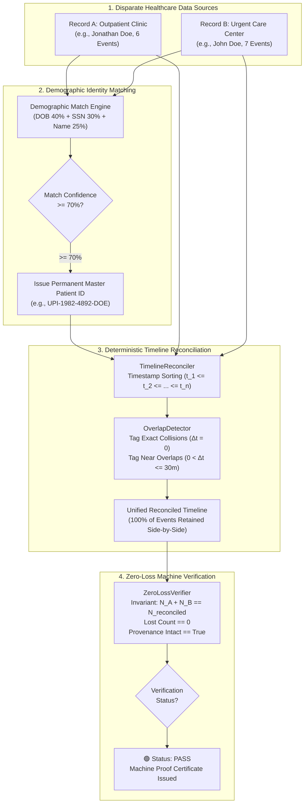

# RECORD FUSE — Duplicate Patient Record Merge Without Timeline Loss

> **CORE GUARANTEE**: NO ORIGINAL CLINICAL EVENT IS SILENTLY LOST.

RECORD FUSE is a specialized healthcare data reconciliation platform designed to detect duplicate patient records and merge their clinical timelines without data loss or silent event deletion.

---

## Architecture & System Workflow

For complete diagrams and mathematical formulas, see [Architecture Documentation](docs/architecture.md).



---

## 🤖 RecordFuse AI Match Analysis Model

RecordFuse evaluates candidate patient duplicate pairs using a multi-factor weighted demographic confidence engine:

```text
🤖 RecordFuse AI Match Analysis

I compared the two patient records using the following weighted factors:

👤 Name              → 25%
📅 Date of Birth     → 25%
📱 Phone Number      → 15%
📧 Email             → 10%
🏠 Address           → 10%
🪪 National ID       → 10%
⚧️ Gender            →  5%
────────────────────────
📊 Total             → 100%

Confidence Score: 90.5%
Decision: 🟢 HIGH CONFIDENCE
Action: APPROVED
```

---

## Project Structure

```
record-fuse/
├── backend/
│   ├── app/
│   │   ├── api/
│   │   │   └── health.py          # GET /health endpoint
│   │   ├── config.py              # Settings & CORS config
│   │   ├── database.py            # SQLite engine & session setup
│   │   └── main.py                # FastAPI app entry point
│   ├── tests/
│   │   └── test_health.py         # Pytest health check tests
│   ├── .env.example
│   ├── .env
│   ├── requirements.txt
│   └── record_fuse.db (SQLite)
├── frontend/
│   ├── src/
│   │   ├── services/
│   │   │   └── api.js             # Axios client for backend APIs
│   │   ├── App.jsx                # React dashboard layout
│   │   ├── index.css              # Tailwind CSS imports
│   │   └── main.jsx
│   ├── .env.example
│   ├── .env
│   ├── package.json
│   └── vite.config.js
└── README.md
```

---

## Quick Start / Setup Commands

### 1. Prerequisites
- Python 3.10+
- Node.js v18+ & npm

---

### 2. Backend Setup & Run

Open Terminal 1:

```bash
cd backend

# Create virtual environment (if not already created)
python -m venv venv

# Activate virtual environment
# On Windows PowerShell:
.\venv\Scripts\Activate.ps1
# On Linux/macOS:
source venv/bin/activate

# Install dependencies
pip install -r requirements.txt

# Run pytest suite
python -m pytest

# Start FastAPI backend server
uvicorn app.main:app --reload --port 8000
```

FastAPI server runs at: `http://localhost:8000`  
Swagger API Docs available at: `http://localhost:8000/docs`  
Health check endpoint: `http://localhost:8000/health`

---

### 3. Frontend Setup & Run

Open Terminal 2:

```bash
cd frontend

# Install npm dependencies
npm install

# Start Vite dev server
npm run dev
```

Frontend application runs at: `http://localhost:5173`

---

## Phase 1 Readiness Status

- [x] Folder structure created
- [x] Python + FastAPI backend configured
- [x] SQLite database connection initialised
- [x] CORS middleware added for frontend `http://localhost:5173`
- [x] `GET /health` endpoint implemented & verified via Pytest
- [x] React + Vite + Tailwind CSS frontend configured
- [x] Frontend-backend connectivity established via Axios
