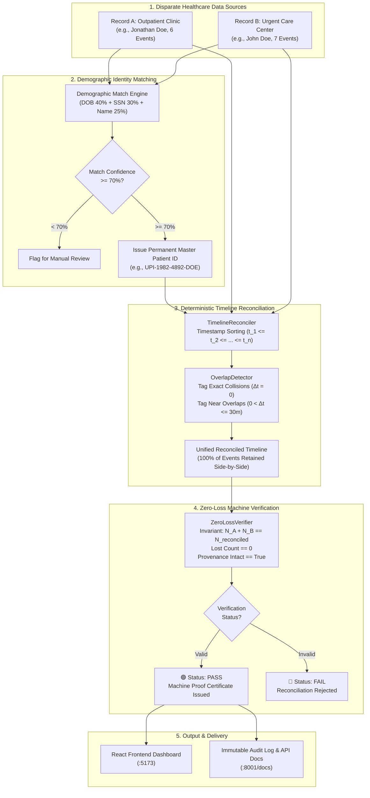
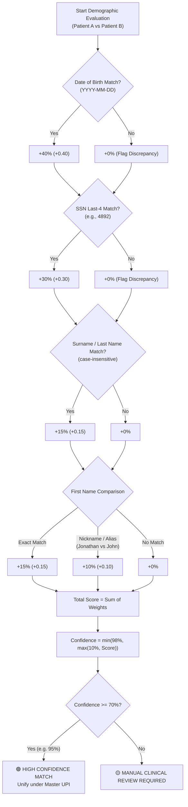
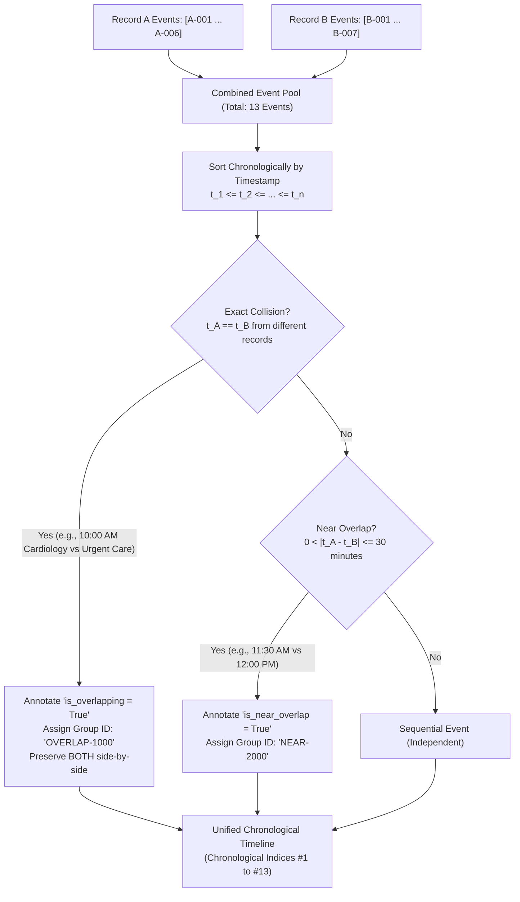
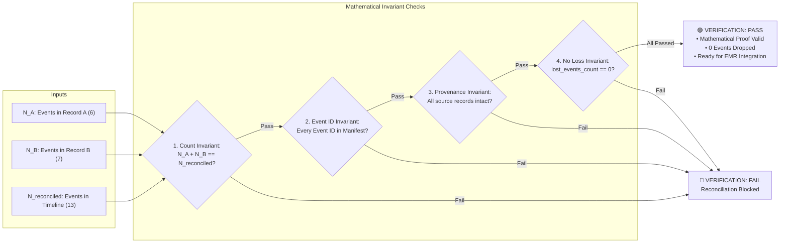

# RECORD FUSE — Architecture & Workflow Diagrams

> **CORE GUARANTEE**: NO ORIGINAL CLINICAL EVENT IS SILENTLY LOST.

This document details the architectural workflows, decision engines, and mathematical invariant checks that power **RECORD FUSE**.

---

## 1. End-to-End System Architecture & Data Flow



---

## 2. Demographic Similarity & Duplicate Matching Engine

```text
🤖 RecordFuse AI Match Analysis

I compared the two patient records using the following weighted factors:

👤 Name              → 25%
📅 Date of Birth     → 25%
📱 Phone Number      → 15%
📧 Email             → 10%
🏠 Address           → 10%
🪪 National ID       → 10%
⚧️ Gender            →  5%
────────────────────────
📊 Total             → 100%

Confidence Score: 90.5%
Decision: 🟢 HIGH CONFIDENCE
Action: APPROVED
```

### Decision Flowchart:



---

## 3. Deterministic Timeline Reconciliation & Concurrency Detection

The reconciliation engine ensures that **no clinical event is ever deleted, overwritten, or summarized away**.



---

## 4. Machine-Checkable Zero-Loss Invariant Verification

Before output is accepted, the `ZeroLossVerifier` enforces mathematical guarantees:



---

## 5. Universal Master Patient Identifier (UPI) Generation

When duplicate records match with high confidence, a deterministic lifetime master identifier is generated:

$$\text{UPI} = \text{"UPI-" } + \text{DOB}_{\text{year}} + \text{"-"} + \text{SSN}_{\text{last4}} + \text{"-"} + \text{Surname}_{\text{uppercase}}$$

* **Example**:
  * Date of Birth: `1982-04-14`
  * SSN Last 4: `4892`
  * Last Name: `Doe`
  * **Result**: `UPI-1982-4892-DOE`
